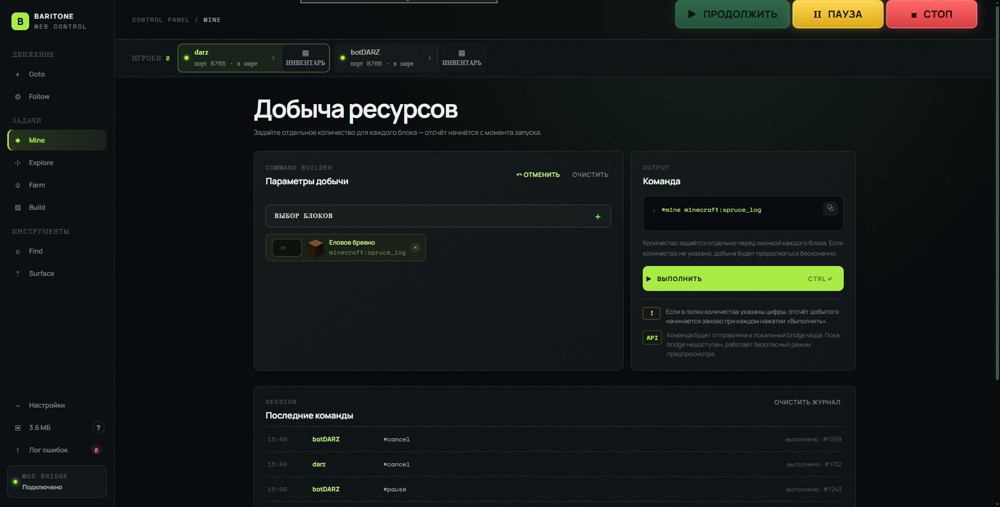
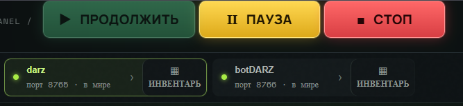
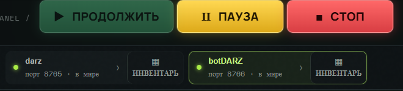
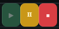
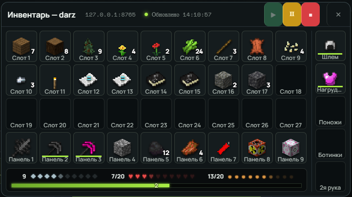
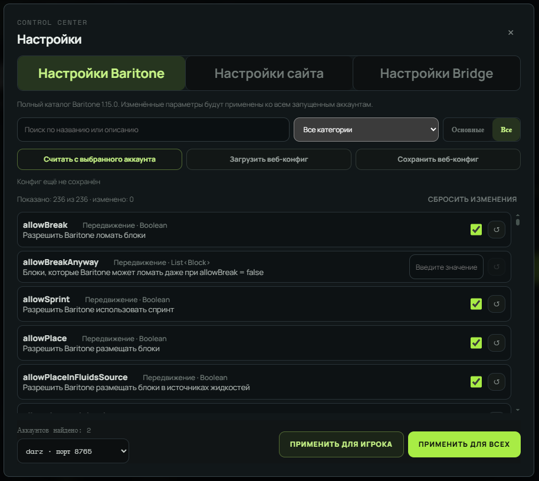

# Baritone Web UI + Forge Bridge 2.5.6

## Кратко о проекте

Это локальная панель управления Baritone для Minecraft. Сайт работает как удобный интерфейс, а мод Bridge связывает его с запущенной игрой.

### Как это работает

1. Установите JAR Bridge в папку `mods` и запустите Minecraft.
2. Откройте `site/site.html` в браузере.
3. Сайт находит Bridge на локальном компьютере и отправляет ему команды.
4. Bridge выполняет команды внутри Minecraft и возвращает результат сайту.

### Основные функции

- запуск команд Baritone: перемещение, поиск, добыча и строительство;
- выбор блоков и предметов из реестров текущей модовой сборки;
- просмотр инвентаря и состояния подключения;
- рендеринг иконок самим Minecraft, включая модовые предметы;
- автоматическое сканирование каталогов при первом запуске;
- кеширование каталога и PNG-иконок с повторным использованием уже готовых файлов;
- отдельные настройки интерфейса и возможность скрыть крафтинговые ячейки;
- просмотр размера кеша, открытие папки кеша и его очистка;
- ограниченная ротация логов Bridge.

Сайт не содержит привязанных к конкретной версии Minecraft текстур и каталогов. Поэтому состав блоков и предметов определяется именно установленной у пользователя сборкой модов.

## Демонстрация

Папка `media/` входит в релиз и содержит GIF и снимки интерфейса для предварительного ознакомления с проектом на GitHub.
Локальный веб-интерфейс для управления Baritone и просмотра инвентаря Minecraft через Forge Bridge.

главная страница при открытии


управление если игроков с бридж модом несколько, нажатием на окно игрока он выбирается и весь функционал работает для него





в инвентаре каждого игрока клавиши управления дублируются с главной страницы



инвентарь в live режиме [броня, хп, еда, полоска опыта с уровнем]





аларм срабатывает при условии что на игроке включена какая либо команда и он потерял хп. без открытого инвентаря не работает


## Что входит

- `site/` — универсальный сайт без текстур, каталогов и иконок конкретной версии Minecraft.
- `bridge-source/` — исходный Forge-проект Bridge.
- `BaritoneWebBridge-Forge-1.19.2-2.5.6.jar` — готовый мод для Forge 1.19.2.
- `BaritoneWebBridge-Forge-1.19.2-2.5.6-sources.zip` — архив исходников.

## Сеть и порты

- Сайт — обычные статические файлы: его можно открыть напрямую через `site.html` или разместить на любом локальном HTTP-сервере.
- Bridge слушает только `127.0.0.1`, поэтому он не открывается в интернет.
- Первый порт Bridge: `8765`.
- Если порт занят, Bridge последовательно проверяет диапазон `8765–8795` и выбирает первый свободный.
- Для каждого запущенного Minecraft-клиента создаётся свой Bridge и свой порт.
- Сайт автоматически ищет активные Bridge в этом диапазоне.

## Иконки и совместимость

Сайт не содержит Minecraft-текстур и не зависит от версии ванильного каталога. Иконки предметов и блоков запрашиваются у Bridge и рендерятся самим Minecraft через `ItemRenderer`. Поэтому поддерживаются предметы из установленной модовой сборки.

При первом подключении Bridge сканирует реальные Forge-реестры блоков и предметов установленной сборки и сохраняет каталог в кеш по fingerprint набора модов. Сайт использует список блоков из этого каталога для Mine и Find. После сканирования Bridge в отдельном фоновом потоке последовательно рендерит и кеширует иконки всех зарегистрированных предметов. После изменения модовой сборки создаётся отдельный каталог и кеш.

В командах используются универсальные ID, например:

```text
minecraft:diamond_ore
create:andesite_alloy_block
modid:block_name
```

## Кеш

Bridge сохраняет отрендеренные PNG-иконки в папке кеша внутри директории игры Minecraft. Кнопка рядом с настройками сайта показывает размер кеша и открывает его папку. Кеш безопасно очищать после закрытия Minecraft: нужные иконки будут созданы заново.

## Логи

Лог Bridge находится в `logs/baritone-web-bridge.log`. Чтобы файл не рос бесконечно, основной и предыдущий лог ротируются примерно на 8 МБ каждый. Успешные фоновые обновления инвентаря отдельно не записываются.

## Оптимизация

- сайт не загружает большие каталоги и наборы иконок Minecraft;
- CSS объединён в один файл `style.css`;
- рендеринг иконок кешируется в памяти и на диске;
- повторный одновременный рендер одной иконки объединяется в один запрос;
- проверка портов выполняется с интервалом 10 секунд;
- обновление инвентаря не перерисовывает окно без изменения данных;
- HTTP-сервер, команды и запись логов работают вне игрового потока, где это возможно.

Подробности установки находятся в `RELEASE-README.txt`.
